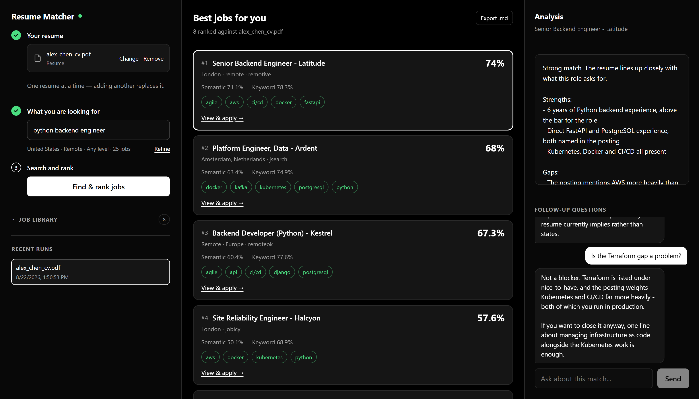
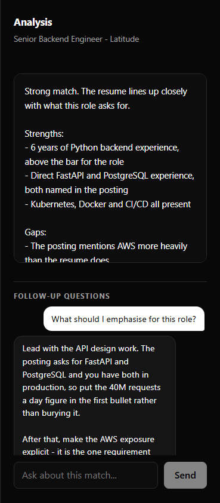
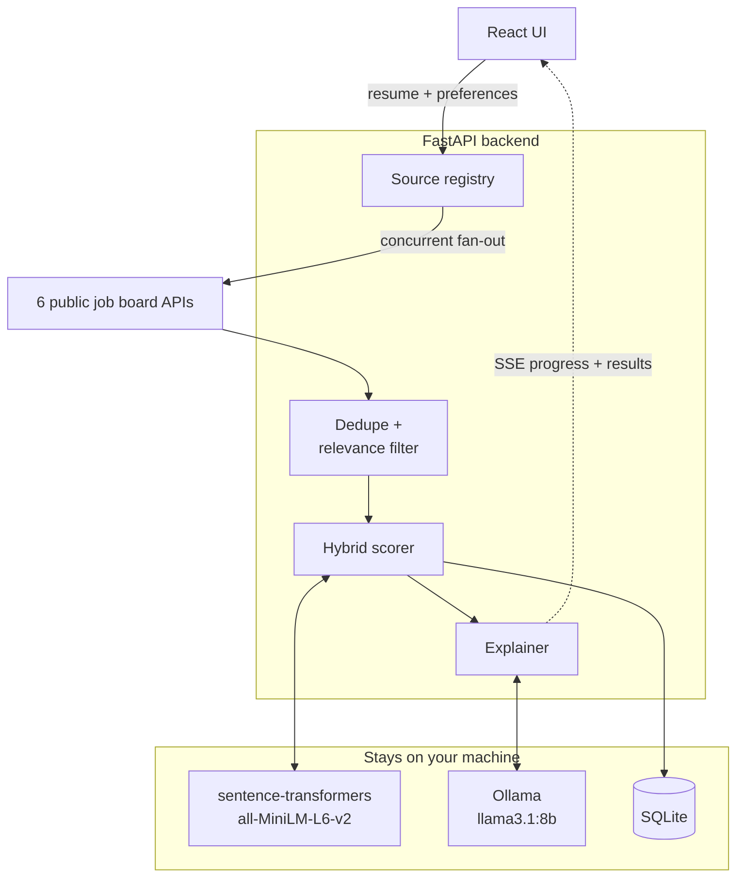

<h1 align="center">Resume Matcher</h1>

<p align="center">
  Find the jobs that actually fit your CV — searched, scored and explained on your own machine.
</p>

<p align="center">
  
  
  
  
  
  
  <a href="https://github.com/yang-githubb/resume-matcher/actions/workflows/ci.yml">
    
  </a>
</p>



Add your resume, say what you are looking for, and one button searches public job
boards, scores every posting against your CV, and explains the fit. Your resume and
every match stay in a SQLite file on your machine, and the analysis is written by an
LLM running locally.

|  |  |
|---|---|
| **Hybrid scoring** | Semantic embeddings blended with keyword and skill overlap |
| **Online discovery** | Live postings from six public job board APIs, four needing no key |
| **Local LLM analysis** | Ollama writes the strengths and gaps, then answers follow-ups |
| **Local-first** | Nothing leaves the machine except the search terms you type |
| **Checked automatically** | Every change runs 43 tests, linting and a full build before it can merge |

**Contents** — [Why](#why-it-is-not-just-keyword-search) · [How it works](#how-it-works) ·
[Stack](#stack) · [Quick start](#quick-start) · [Using it](#using-it) ·
[Job sources](#job-sources) · [Engineering notes](#engineering-notes) ·
[Configuration](#configuration) · [API](#api) · [Layout](#project-layout) ·
[Development](#development)

## Why it is not just keyword search



A keyword filter cannot tell you that six years of FastAPI answers a posting asking
for "strong backend focus". Two signals are blended instead: the cosine distance
between embeddings of your resume and the posting, and the overlap of concrete
skills and keywords. Each result shows both, so a high score with weak keyword
overlap reads differently from the reverse.

Click any result and a local model explains the match — what lines up, what is
missing, and what to change. Ask follow-ups in the panel and it answers with the
job description and your resume already in context.

<br clear="right">

## How it works

One click runs the whole pipeline. Boards are queried concurrently, results are
deduplicated and filtered for relevance, every survivor is scored against your resume,
and the top few get an LLM write-up — with progress streamed back as it happens
rather than a spinner.



### Scoring

```
overall        = 0.6 x semantic_similarity + 0.4 x keyword_blend
keyword_blend  = 0.6 x skill_overlap + 0.4 x keyword_overlap
```

Semantic similarity is the cosine distance between embeddings of the resume and the
posting. Scores are on a 0–100 scale. Weights are configurable in `backend/.env`.

## Stack

| Layer | Tech |
|-------|------|
| Backend | Python, FastAPI, SQLite |
| Embeddings | `sentence-transformers` (`all-MiniLM-L6-v2`, local CPU) |
| LLM | Ollama (`llama3.1:8b`) |
| Frontend | Vite, React, TypeScript, TanStack Query |
| Parsing | PyMuPDF (PDF), python-docx (DOCX), plain-text paste |

## Quick start

### Prerequisites

- **Python 3.11+** and **Node.js 18+**
- **Ollama** running locally (optional — ranking works without it, analysis falls back
  to a rule-based summary):

  ```bash
  ollama pull llama3.1:8b
  ollama serve
  ```

### Setup

From the repository root:

```bash
cd backend
python -m venv .venv
.venv/Scripts/activate      # macOS/Linux: source .venv/bin/activate
pip install -r requirements.txt
cp .env.example .env
```

```bash
cd frontend
npm install
```

### Run

On Windows, `scripts/start-dev.ps1` launches both servers. Otherwise use two terminals:

```bash
cd backend && .venv/Scripts/activate && python -m uvicorn app.main:app --reload --port 8010
```

```bash
cd frontend && npm run dev
```

| URL | What |
|-----|------|
| http://localhost:5273 | Web app |
| http://localhost:8010/docs | Interactive API docs |
| http://localhost:8010/health | Status and model config |

> On Windows the `--reload` watcher can miss changes. If an edit does not seem to
> take effect, restart the backend.

## Using it

The left rail is a numbered walkthrough — each step ticks green as you complete it.

1. Add your **resume** — upload a PDF/DOCX or paste the text
2. Set what you want: role, experience level, city, country, remote-only, how many
   postings to pull, and a minimum match score
3. Click **Find & rank jobs**

That is the only ranking action. It searches the boards, scores every result against
your resume, writes an analysis for the top few, and links straight to each posting.

Then click any result for its **analysis**, ask **follow-up questions** in the chat
panel, or **Export .md** to save the report.

**One resume at a time.** Adding another replaces it, clears the rankings the previous
one produced, and deletes the old copy — except where a saved session still refers to it.

**The job library** holds postings you add by hand plus everything past searches pulled
in. Hand-added jobs are ranked alongside every search, so a posting you found yourself
is scored too. Previously discovered jobs stay for their apply links but are not
re-ranked, so each search returns fresh results rather than resurfacing stale ones.

**Saved sessions** keep the 5 most recent runs; older ones are deleted along with their
results and chat history.

> Screenshots use a made-up resume and invented postings, not real data.

## Job sources

| Source | API key | Covers |
|--------|---------|--------|
| **The Muse** | **no** | **Onsite and remote in 9 countries across the US and Europe** |
| Remotive | no | Remote roles |
| RemoteOK | no | Remote roles |
| Arbeitnow | no | EU roles, including onsite |
| Jobicy | no | Remote roles |
| JSearch | free tier | Google for Jobs — worldwide |
| Adzuna | free tier | Onsite and remote across 18 countries |

**No key is needed for any of it.** The Muse carries the geography — pick a country
and results are genuinely narrowed to it — while the other keyless boards add remote
roles, which are open from anywhere. That is why the search targets **the US and
Europe**: it is the coverage that exists without asking anyone to sign up.

The Muse filters per city rather than per country, and silently ignores a place it
does not recognise — returning unfiltered jobs that look filtered. So each country is
covered by cities verified to return their own postings, and a country without one
returns nothing rather than quietly serving jobs from anywhere.

**Adding a key widens it.** JSearch reads Google for Jobs, so it surfaces LinkedIn and
Indeed postings worldwide and enables the city filter; take the free tier on
[RapidAPI](https://rapidapi.com/letscrape-6bRBa3QguO5/api/jsearch) and set
`JSEARCH_API_KEY` in `backend/.env`. Adzuna adds onsite listings across its 18
countries.

These are official public APIs, not scraped pages. LinkedIn and Indeed block automated
access and their terms forbid it, so they are not scraped directly.

**The app only offers filters it can actually apply.** The four keyless boards list
remote roles worldwide and expose no geographic filter, so with none of the keyed
sources configured the city field is disabled and picking a country it cannot search
says so, rather than quietly returning another region's jobs. Each source declares
what it supports and the interface reads that from the registry, so a new board
cannot reintroduce a dead control by accident.

## Engineering notes

The parts that took the most thought, and why they ended up this way.

**Relevance is weighted toward the job title.** Boards match free text loosely, so a
search for "python backend engineer" came back full of sales and design roles that
merely contained the word "engineer". Scoring title hits at 0.7 and body hits at 0.3
dropped a sales listing to 0.10 while a real backend post scored 0.80.

**A failing board is skipped, not fatal.** Six APIs are queried concurrently with
`asyncio.gather`; one timing out or changing its schema loses that board's results and
nothing else. Duplicates are collapsed by source ID, then by normalised title and
company, since the same posting is syndicated to several boards.

**Progress is real, not a fake bar.** The search streams Server-Sent Events through
`fetch` and a `ReadableStream`, reporting the stage it is actually in — searching,
collecting, scoring, analysing — because the work takes long enough that a spinner
would be dishonest about what is happening.

**Degrading beats failing.** No Ollama means analysis falls back to a rule-based
summary rather than an error; ranking never depended on the LLM. No API keys means the
four keyless boards still work.

**Derived state is invalidated together.** Replacing a resume clears the rankings it
produced, drops the stored file, and resets the selection — rankings that describe a
resume you no longer have are worse than none. Saved sessions are capped at 5 and
orphaned resumes are pruned on upload, so the database stays bounded.

**Adding a board is one file.** Each source exposes `NAME`, `LABEL`, `REQUIRES_KEY`,
`SUPPORTS_LOCATION`, `SUPPORTS_COUNTRY`, `COUNTRIES`, `is_available()` and
`fetch(client, query)`, then goes in `registry.MODULES`.
Relevance, deduplication, error handling and concurrency are handled for it.

## Configuration

All settings live in `backend/.env` (see `.env.example`):

| Variable | Default | Purpose |
|----------|---------|---------|
| `OLLAMA_BASE_URL` | `http://localhost:11434` | Ollama endpoint |
| `OLLAMA_MODEL` | `llama3.1:8b` | Model used for analysis and chat |
| `EMBEDDING_MODEL` | `all-MiniLM-L6-v2` | Sentence-transformers model |
| `EMBEDDING_DEVICE` | `cpu` | Set `cuda` if you have a supported GPU |
| `SEMANTIC_WEIGHT` / `KEYWORD_WEIGHT` | `0.6` / `0.4` | Score blend, must sum to 1.0 |
| `DATABASE_PATH` | `./data/resume_matcher.db` | SQLite file |
| `UPLOAD_DIR` | `./data/uploads` | Stored uploads |
| `JSEARCH_API_KEY` | empty | Enables the JSearch source |
| `ADZUNA_APP_ID` / `ADZUNA_APP_KEY` | empty | Enables the Adzuna source |

## API

| Endpoint | Purpose |
|----------|---------|
| `GET /health` | Status and model config |
| `POST /documents/upload` | Upload a PDF/DOCX resume or job |
| `POST /documents/text` | Add a resume or job as plain text |
| `GET /documents/jobs?origin=` | List jobs — `manual`, `discovered` or `all` |
| `DELETE /documents/{id}` | Remove a document |
| `GET /discover/sources` | Which boards exist and which are configured |
| `POST /discover/match` | Search boards and rank against a resume |
| `POST /discover/match/stream` | Same, streamed with progress (used by the UI) |
| `GET /sessions` | List saved runs |
| `GET /sessions/{id}` | Reload a run |
| `GET /sessions/{id}/export` | Download the run as markdown |
| `GET /chat/{session_id}` | Chat history |
| `POST /chat` | Ask a follow-up about a match |

## Project layout

```text
resume-matcher/
├── backend/
│   ├── app/
│   │   ├── main.py         # App setup, /health
│   │   ├── config.py       # Settings from .env
│   │   ├── db.py           # SQLite schema, migrations, queries
│   │   ├── schemas.py      # Shared request/response models
│   │   ├── routes/         # documents, discover, sessions, chat
│   │   ├── sources/        # One module per job board, behind a shared adapter
│   │   ├── matching/       # Embeddings, keyword overlap, hybrid score
│   │   ├── explain/        # Ollama prompts + offline fallback
│   │   ├── parsers/        # PDF/DOCX text extraction and skill parsing
│   │   └── services/       # Markdown export
│   ├── fixtures/           # Sample resume and job used by tests
│   └── tests/
├── docs/                   # Screenshots used by this README
├── frontend/
│   └── src/
│       ├── App.tsx         # Layout, health pill, saved sessions
│       ├── components/     # Resume input, search panel, library, results, chat
│       ├── lib/api.ts      # Typed API client, including the SSE reader
│       └── types/api.ts    # Response types mirroring the backend schemas
└── scripts/                # start-dev.ps1
```

## Development

```bash
cd backend && .venv/Scripts/activate && pytest -q     # 38 backend tests
cd frontend && npm test                               # 5 frontend tests
cd frontend && npm run lint && npx tsc -b             # lint + typecheck
cd frontend && npm run build                          # production build
```

### Quality checks

**In plain terms:** the green badge at the top of this page means the code in
this repository was checked automatically and passed. It is not a claim - it is
a machine result, re-run on every single change, and anyone can click it to see
the history.

GitHub Actions runs the following on every push and pull request. If any step
fails, the badge turns red and the change does not merge.

| Check | What it catches |
|-------|-----------------|
| 38 backend tests | Scoring, parsing, job-board adapters, database migrations |
| 5 frontend tests | Progress-stream parsing, including frames split across network chunks |
| Lint + typecheck | Unused code, type errors, unsafe assumptions |
| Production build | Anything that compiles in development but breaks when shipped |

The ranking tests score real embeddings rather than stubbing them out, so a
change that quietly makes matching worse fails the build instead of shipping.

The first search downloads the embedding model (~90MB) and is slower than the rest.
After that, scoring a batch of postings takes a few seconds on CPU; the analysis step
is usually what you are waiting for.

## License

[MIT](LICENSE) — free to use, modify and distribute.
